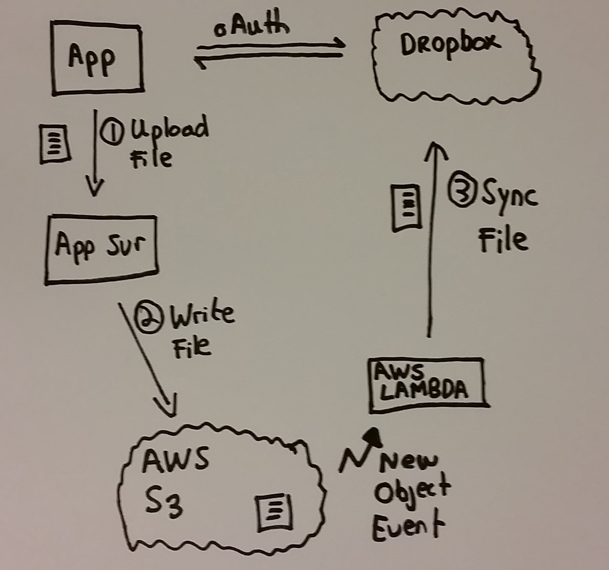

## S3DropboxFileSync


Upload files to an AWS S3 bucket and automatically sync them  to a dropbox account using a an AWS Lambda function.

 


###  Prerequisites
* Node.js http://www.nodejs.org/
* Express http://expressjs.com/
* AngularJS http://angularjs.org/
* Grunt - Download and Install http://gruntjs.com
* AWS Developer Key
* Dropbox Developer key - https://www.dropbox.com/developers/core


### Install Prerequisites
```
$ npm install -g bower
$ npm install -g nodemon

```
###  Technologies

Client - Angular.js ,Bootstrap, Sass

Server - Node.js,  Express server

DropBox File Sync - AWS Lambda function (written in node.js)


## Configuration Settings - Node.js App Server

* Create the file server/config/env/development.js & specify the following value

```
'use strict';

module.exports = {
    dropbox: {appKey: "YOUR DROPBOX APP KEY",
        appSecret: "YOUR DROPBOX APP SECRET"},

    aws: {   accessKey: "YOUR AWS ACCESS KEY",
        secretKey: "YOUR AWS SECRET KEY",
        tokenBucket: "NAME OF A PRIVATE S3 BUCKET TO STORE DROPBOX BEARER TOKEN",
        fileUploadBucket: "NAME OF AN S3 BUCKET TO UPLOAD FILES"
    }
};
```

## Configuration Settings - AWS Lambda Function

* Create the file AWS lambda functions/dropbox-s3-sync/config/env/development.js & specify the following value

```
'use strict';

module.exports = {
    dropbox: {appKey: "YOUR DROPBOX APP KEY",
        appSecret: "YOUR DROPBOX APP SECRET"},

    aws: {   accessKey: "YOUR AWS ACCESS KEY",
        secretKey: "YOUR AWS SECRET KEY",
        tokenBucket: "NAME OF A PRIVATE S3 BUCKET TO STORE DROPBOX BEARER TOKEN",
        fileUploadBucket: "NAME OF AN S3 BUCKET TO UPLOAD FILES"
    }
};
```

### To build the client web application
```
$ cd /client
$ grunt serve

```

### To run the app server
```
$ cd /server
$ npm test
```
open a browser and navigate to http://localhost:3000 & off you go!

### To deploy the AWS Lambda function
```
$ cd  "/AWS lambda functions/dropbox-s3-sync"
$ grunt lambda_package lambda_deploy
```

## Credits
  * To the very nifty <a href="https://www.npmjs.com/package/grunt-aws-lambda">grunt aws lambda</a> task.
  * Good  <a href="http://thau.me/2014/02/nodejs-streaming-files-to-amazons3/">Blog</a> post on streaming files to S3 from node.js


## License
[The MIT License](http://opensource.org/licenses/MIT)